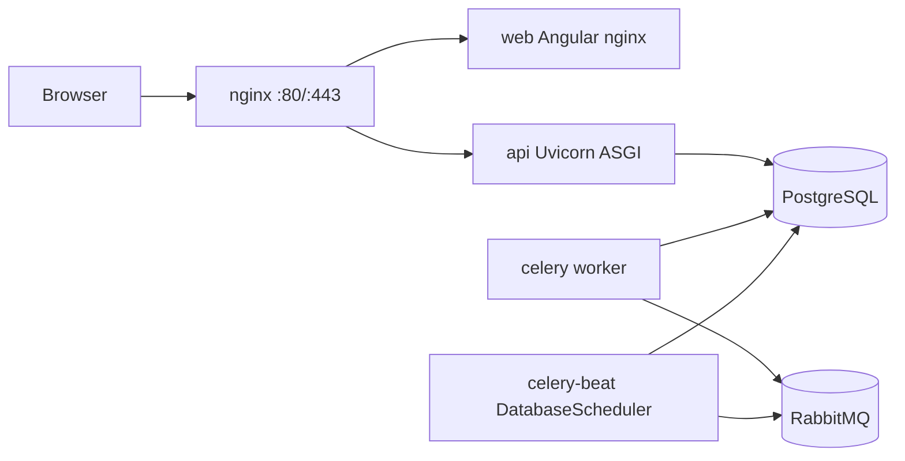

# Deployment

## Topology

The default deployment targets shared infrastructure on `10.0.0.3` (Postgres 16, Redis 7, RabbitMQ 3). The compose stack only ships application containers; `db`, `redis`, and `rabbitmq` are available under the `local-infra` profile for offline development.



## Docker compose (famlotto-style 3 machines)

| Service | Role | Image / container suffix |
|---------|------|---------------------------|
| **api** | Uvicorn, migrate, optional seed | `venzaflow-api_${ENVIRONMENT}` |
| **celery** | Worker (`${ENV}_default`, `${ENV}_billing` queues) | `venzaflow-celery_${ENVIRONMENT}` |
| **celery-beat** | Periodic tasks (django-celery-beat DB) | `venzaflow-celery-beat_${ENVIRONMENT}` |
| **web** | Angular static (nginx) | `venzaflow-web_${ENVIRONMENT}` |

Set `ENVIRONMENT=dev` or `ENVIRONMENT=prod` in `.env`. Compose adds `_dev` / `_prod` to image and container names. Celery queues are isolated per environment (`dev_default`, `prod_billing`, etc.) on the shared RabbitMQ broker.

`docker/docker-compose.yml` runs all four services; api/celery/celery-beat share the same backend Dockerfile. The API image installs WeasyPrint for subscription invoice PDFs.

To switch uvicorn config, the entrypoint copies `uvicorn_dev.conf.py` or `uvicorn_prod.conf.py` based on `ENVIRONMENT`.

Bring up (shared infra):

```bash
cp .env.example .env  # edit secrets if needed
docker compose -f docker/docker-compose.yml --env-file .env up --build
```

Offline / local dev with local Postgres + Redis + RabbitMQ:

```bash
docker compose -f docker/docker-compose.yml --env-file .env --profile local-infra up --build
```

App: `http://localhost`, API: `http://localhost/api/v1/`, Swagger: `http://localhost/api/docs/`.

## Shared infrastructure credentials (defaults)

```
POSTGRES_HOST=10.0.0.3
POSTGRES_USER=venzaflowuser
POSTGRES_PASSWORD=!->ts961ts11ts.*
POSTGRES_DB=venzaflow

REDIS_HOST=10.0.0.3
REDIS_PORT=6379
REDIS_PASSWORD=MO9Ala5M4uITQYXpX3QErNZFuHx1
REDIS_DB=2

RABBITMQ_HOST=10.0.0.3
RABBITMQ_USER=aykutt.ars
RABBITMQ_PASS=ayk55577ayk
RABBITMQ_PORT=5672
```

Celery uses RabbitMQ as broker (`RABBITMQ_*` in `.env`). Task results and beat schedules are stored in **Postgres** via `django-celery-results` and `django-celery-beat` (no Redis required for Celery). Run `seed_demo` (or Django admin → *Periodic tasks*) to register the hourly TCMB job.

## Migrations & seed

`backend/docker-entrypoint.sh` runs `python manage.py migrate` on every **api** container start. To seed demo tenants, billing master data (currencies, KDV, module prices), periodic tasks, and example users, set `RUN_SEED=true` in `.env` (dev only) or:

```bash
docker compose -f docker/docker-compose.yml --env-file .env exec api python manage.py seed_demo
```

After changing `backend/requirements.txt` or `Dockerfile`, rebuild images: `docker compose ... up --build`.

## Backups

- Daily `pg_dump -Fc venzaflow > venzaflow-$(date +%F).dump` via cron / systemd timer.
- Restore: `pg_restore --clean --if-exists --no-owner -d venzaflow venzaflow-YYYY-MM-DD.dump`.

## TLS

Terminate TLS at the front `proxy` service. Provide certs via a volume mount and update `docker/nginx/default.conf` with `listen 443 ssl;` and `ssl_certificate*` directives. Or use a managed LB / cloud ingress upstream.

## Healthchecks

- `GET /health` (nginx proxy)
- `GET /api/v1/health/` (Django)
- `pg_isready` on `db`
- `redis-cli ping` on `redis`

## Smoke test

`./docker/scripts/smoke-test.sh` (export `SMOKE_BASE=http://your-host` to point elsewhere).
