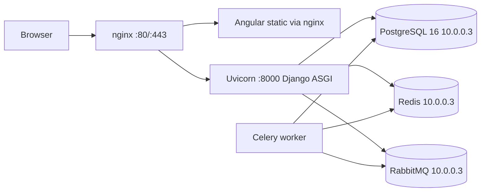

# Deployment

## Topology

The default deployment targets shared infrastructure on `10.0.0.3` (Postgres 16, Redis 7, RabbitMQ 3). The compose stack only ships application containers; `db`, `redis`, and `rabbitmq` are available under the `local-infra` profile for offline development.



## Docker compose

`docker/docker-compose.yml` wires: `backend` (uvicorn ASGI server, entrypoint runs `migrate` + optional `seed_demo` and picks `uvicorn_{dev,prod}.conf.py` from `ENVIRONMENT`), `worker` (Celery), `frontend` (nginx with Angular dist), `proxy` (front nginx). All point at the shared infra via `.env`.

To switch between dev/prod uvicorn configs, set `ENVIRONMENT=dev` or `ENVIRONMENT=prod` in `.env`. The entrypoint copies `uvicorn_dev.conf.py` or `uvicorn_prod.conf.py` to `uvicorn.conf.py` and `run_uvicorn.py` reads it.

Bring up (shared infra):

```bash
cp .env.example .env  # edit secrets if needed
docker compose -f docker/docker-compose.yml --env-file .env up --build
```

Offline / local dev with local Postgres + Redis + RabbitMQ:

```bash
docker compose -f docker/docker-compose.yml --env-file .env --profile local-infra up --build
```

App: `http://localhost`, API: `http://localhost/api/v1/`, Swagger: `http://localhost/api/docs/`.

## Shared infrastructure credentials (defaults)

```
POSTGRES_HOST=10.0.0.3
POSTGRES_USER=tenancyuser
POSTGRES_PASSWORD=!->ts961ts11ts.*
POSTGRES_DB=tenancysoft

REDIS_HOST=10.0.0.3
REDIS_PORT=6379
REDIS_PASSWORD=MO9Ala5M4uITQYXpX3QErNZFuHx1
REDIS_DB=2

RABBITMQ_HOST=10.0.0.3
RABBITMQ_USER=aykutt.ars
RABBITMQ_PASS=ayk55577ayk
RABBITMQ_PORT=5672
```

Celery uses RabbitMQ as broker and Redis as result backend. `config/settings/base.py` computes the URLs automatically from the host/user/password variables; `CELERY_BROKER_URL` / `CELERY_RESULT_BACKEND` can still be set explicitly to override.

## Migrations & seed

`backend/docker-entrypoint.sh` runs `python manage.py migrate` on every container start. To seed demo tenants and example users, set `RUN_SEED=true` in `.env` (dev only) or run `docker compose exec backend python manage.py seed_demo`.

## Backups

- Daily `pg_dump -Fc tenancysoft > tenancysoft-$(date +%F).dump` via cron / systemd timer.
- Restore: `pg_restore --clean --if-exists --no-owner -d tenancysoft tenancysoft-YYYY-MM-DD.dump`.

## TLS

Terminate TLS at the front `proxy` service. Provide certs via a volume mount and update `docker/nginx/default.conf` with `listen 443 ssl;` and `ssl_certificate*` directives. Or use a managed LB / cloud ingress upstream.

## Healthchecks

- `GET /health` (nginx proxy)
- `GET /api/v1/health/` (Django)
- `pg_isready` on `db`
- `redis-cli ping` on `redis`

## Smoke test

`./docker/scripts/smoke-test.sh` (export `SMOKE_BASE=http://your-host` to point elsewhere).
