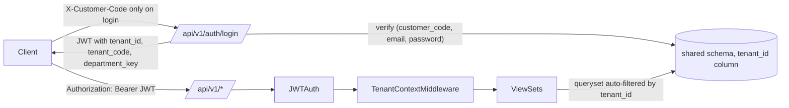

# Multi-tenancy proposal

## Strategy: shared schema, row-level `tenant_id`

Each business table carries a non-null `tenant_id` FK to `Tenant`. Tenant isolation is enforced at three layers (defense in depth):

1. **Model manager**: `TenantOwnedModel` uses `TenantScopedManager` that filters by the thread-local current tenant for default queries. `Model.all_tenants` exposes the unfiltered manager for admin/migrations/seeding.
2. **Middleware**: `TenantContextMiddleware` reads `tenant_id` from the validated JWT and binds it for the request lifecycle.
3. **ViewSet**: `TenantScopedViewSet.get_queryset()` re-applies `filter(tenant_id=request.user.tenant_id)`; `perform_create()` stamps the tenant from the authenticated user, ignoring any forged payload.

Optional fourth layer: PostgreSQL row-level security policies in production using `current_setting('app.tenant_id')::bigint`, enabled per table.

## Rationale (per the user's brief)

- Tenants are small (30–40 users, ≥ 2 departments) — schema-per-tenant adds operational cost without proportional value.
- Per-tenant customization is handled via `Tenant.enabled_modules` and (optionally) plan flags; new modules ship to all tenants but each can opt-in.
- Backups are simple (a single `pg_dump`); restoring a single tenant is feasible with `WHERE tenant_id = ?` filters.

## Cross-tenant tests

See `backend/apps/tenants/tests.py`: 7 tests cover list, retrieve, delete, create-with-stamp, forged-tenant payload, and module-disabled responses.
