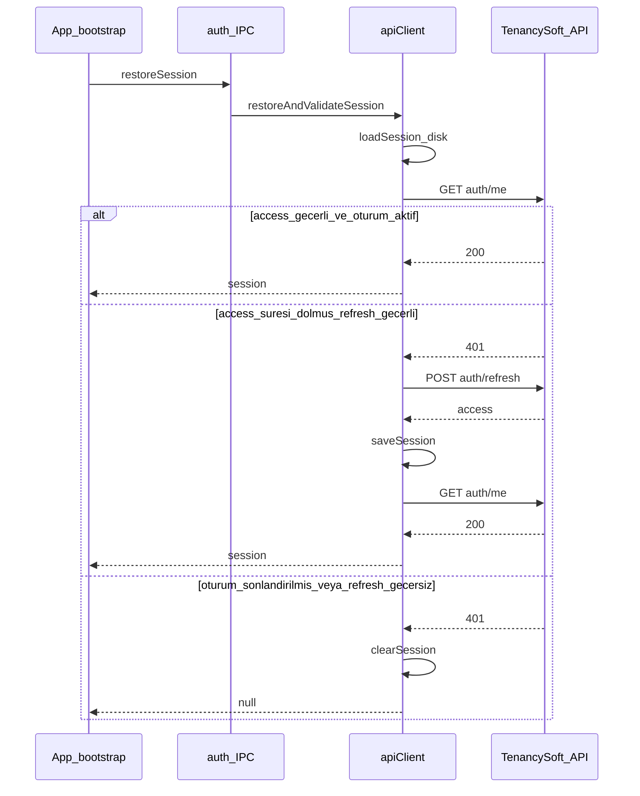

# Token Doğrulama ve Refresh Planı

## Mevcut durum

Backend zaten gerekli uçları sağlıyor:

| Endpoint | Amaç |
|----------|------|
| `GET /api/v1/auth/me/` | Access token + `UserSession.revoked` kontrolü |
| `POST /api/v1/auth/refresh/` | Body: `{ refresh }` → `{ access }` |
| `POST /api/v1/auth/logout/` | Body: `{ refresh }` → refresh blacklist + session revoke |

`TenantJWTAuthentication` her istekte `sid` claim'ine göre `UserSession.revoked` kontrol eder; sunucuda sonlandırılmış oturum `401` + `"Session revoked."` döner.

Masaüstü tarafında eksikler:

- [`src/main/ipc/auth.ts`](src/main/ipc/auth.ts) — `AUTH_RESTORE` diski okuyup `setSession` yapıyor, API'ye sormuyor
- [`src/main/services/apiClient.ts`](src/main/services/apiClient.ts) — `refreshToken` login'de kaydediliyor ama hiç kullanılmıyor; `listSignTasks` vb. 401'de yenileme yok
- `AUTH_LOGOUT` — sadece yerel temizlik; sunucuya `logout` çağrısı yok

## Uygulama adımları

### 1. `apiClient.ts` — oturum yaşam döngüsü merkezi

[`src/main/services/apiClient.ts`](src/main/services/apiClient.ts) içine eklenecek metotlar:

**`fetchWithAuth(url, init?)`**
- Mevcut `headers(true)` ile istek atar
- `401` alırsa ve `refreshToken` varsa **bir kez** `refreshAccessToken()` dener, yeni access ile isteği tekrarlar
- Refresh de başarısızsa → `clearInvalidSession()` (memory + disk) → `SessionExpiredError` fırlat
- `listSignTasks`, `prepareSignTask`, `completeSignTask` ve diğer auth gerektiren çağrılar bu wrapper üzerinden gider

**`getMe(): Promise<void>`**
- `GET /api/v1/auth/me/` — 200 ise oturum geçerli
- 401 ise hata (üst katman refresh dener)

**`refreshAccessToken(): Promise<void>`**
- `POST /api/v1/auth/refresh/` body: `{ refresh: session.refreshToken }`
- Yanıttan yeni `access` alır, `this.session.accessToken` günceller
- [`secureStore.saveSession`](src/main/services/secureStore.ts) ile diske yazar
- Refresh yoksa veya 401/400 dönerse hata

**`restoreAndValidateSession(): Promise<AuthSession | null>`** (açılış akışı)
1. `loadSession()` — yoksa `null`
2. `setSession(stored)`
3. `getMe()` dene
4. 401 ise `refreshAccessToken()` + `getMe()` tekrar
5. Hâlâ başarısızsa `clearInvalidSession()` → `null`
6. Başarılıysa güncel session döner

**`logout(): Promise<void>`**
- `refreshToken` varsa `POST /api/v1/auth/logout/` (Authorization + body `{ refresh }`)
- Ağ hatası olsa bile yerel oturum temizlenir (`clearSession` + `setSession(null)`)

**`SessionExpiredError`** — renderer'ın ayırt edebileceği basit bir `Error` alt sınıfı (mesaj: oturum sonlandırıldı / süresi doldu)

### 2. `auth.ts` IPC güncellemesi

[`src/main/ipc/auth.ts`](src/main/ipc/auth.ts):

| Handler | Değişiklik |
|---------|------------|
| `AUTH_RESTORE` | `loadSession` + `setSession` yerine `apiClient.restoreAndValidateSession()` |
| `AUTH_LOGOUT` | `apiClient.logout()` çağrısı |
| `AUTH_SESSION` | İsteğe bağlı: sadece memory'deki session'ı döner (mevcut davranış yeterli) |

`AUTH_RESTORE` başarısız doğrulamada `ok(null)` döner — [`App.tsx`](src/renderer/src/App.tsx) zaten `Boolean(session)` ile login'e yönlendiriyor; ek UI değişikliği gerekmez.

### 3. Renderer — çalışma anı oturum düşmesi

[`src/renderer/src/pages/Dashboard.tsx`](src/renderer/src/pages/Dashboard.tsx) ve task yükleme/imzalama hatalarında `SessionExpiredError` veya IPC `ok: false` + oturum mesajı yakalanırsa:
- `window.api.auth.logout()` (sunucu + yerel temizlik)
- `onLogout()` ile login ekranına dön

Bu, kullanıcı uygulamayı açık tutarken admin panelden oturumu kapattığında bir sonraki API çağrısında güvenli çıkış sağlar.

### 4. Değişmeyecek dosyalar

- [`src/shared/types.ts`](src/shared/types.ts) — `AuthSession.refreshToken` zaten var
- [`src/preload/index.ts`](src/preload/index.ts) — IPC imzaları aynı kalır
- Backend — değişiklik gerekmez

## Hata senaryoları

| Durum | Davranış |
|-------|----------|
| Diskte session yok | `restoreSession` → `null` → login |
| Access geçerli, session aktif | Dashboard'a devam |
| Access süresi dolmuş, refresh geçerli | Sessiz yenileme, session kaydedilir |
| Session sunucuda revoke | `me` 401, refresh de 401 → yerel temizlik → login |
| API erişilemez (ağ) | `restore` sırasında: mevcut `ConnectionBanner` davranışı korunur; **offline açılışta** session'ı silmemek için `getMe` ağ hatasında (fetch throw) session'ı koruyup geçici olarak authenticated bırakmak veya kullanıcıyı uyarmak tercih edilebilir — öneri: **ağ hatası ≠ oturum geçersiz**; sadece `401`/`403` durumunda temizle |

Son satır önemli: `ECONNREFUSED` veya timeout'ta oturumu silmeyin; kullanıcı offline çalışamaz ama token geçerliyken gereksiz login istemez.

## Manuel test planı

1. **Geçerli oturum** — login, kapat/aç → dashboard'a direkt girilmeli
2. **Süresi dolmuş access** — access'ı manuel expire edin (veya kısa TTL) → açılışta refresh ile yenilenmeli
3. **Sunucuda revoke** — admin'den oturumu kapat → uygulama açılışında veya task listesinde login'e düşmeli
4. **Logout** — çıkışta backend'de session revoke + yerel `session.dat` silinmeli
5. **Offline açılış** — API kapalıyken açılış → oturum silinmemeli, banner uyarısı görünmeli

## Dosya özeti

| Dosya | İş |
|-------|-----|
| [`src/main/services/apiClient.ts`](src/main/services/apiClient.ts) | `fetchWithAuth`, `getMe`, `refreshAccessToken`, `restoreAndValidateSession`, `logout` |
| [`src/main/ipc/auth.ts`](src/main/ipc/auth.ts) | Restore ve logout handler'ları bağla |
| [`src/renderer/src/pages/Dashboard.tsx`](src/renderer/src/pages/Dashboard.tsx) | Oturum düşme hatasında logout + yönlendirme |
